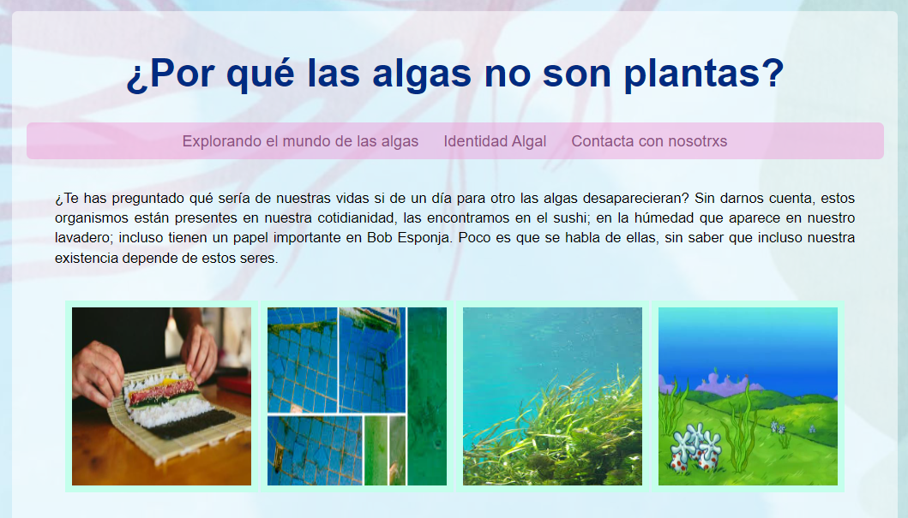
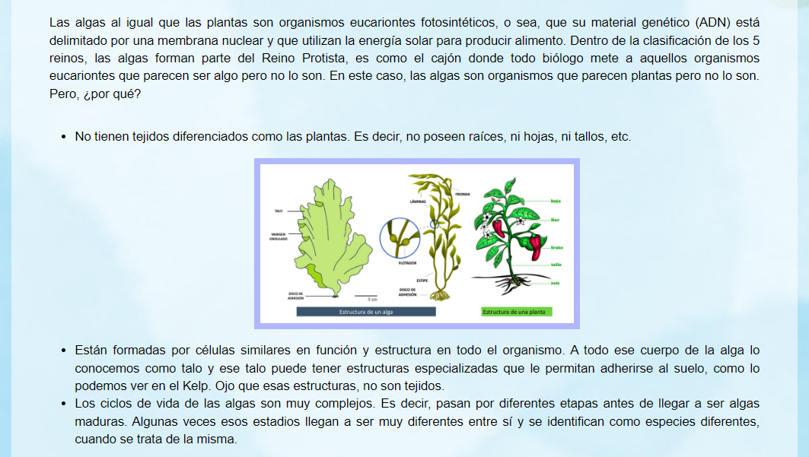
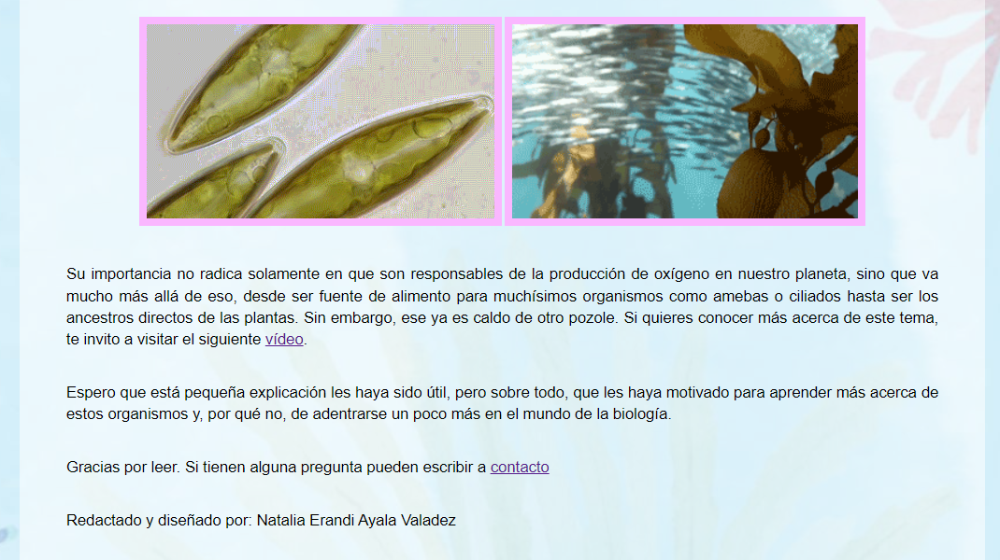

# Un pequeño vistazo al mundo de las algas

Las algas, presentes en aspectos cotidianos como el sushi y los ecosistemas acuáticos, son fundamentales para la vida en la Tierra. Aunque a menudo se confunden con plantas, estas fascinantes criaturas tienen características únicas que las distinguen. Desde su estructura simple y su ciclo de vida complejo hasta su crucial papel en la producción de oxígeno, las algas son mucho más de lo que parecen. Este contenido te invita a descubrir por qué nuestras vidas dependen tanto de ellas y a explorar su increíble diversidad y relevancia ecológica.

[Proyecto Desplegado (https://mi-primera-pagina-gamma.vercel.app/)](https://mi-primera-pagina-gamma.vercel.app/)

## Secciones de mi sitio

## Tecnologías

* HTML
* CSS
* Bootstrap
* Javascript
---

Desarrollado con ♡ por [Natalia Ayala](https://www.instagram.com/natalia.vdz/) en [TECHNOLOCHICAS PRO](https://tecnolochicas.mx/).